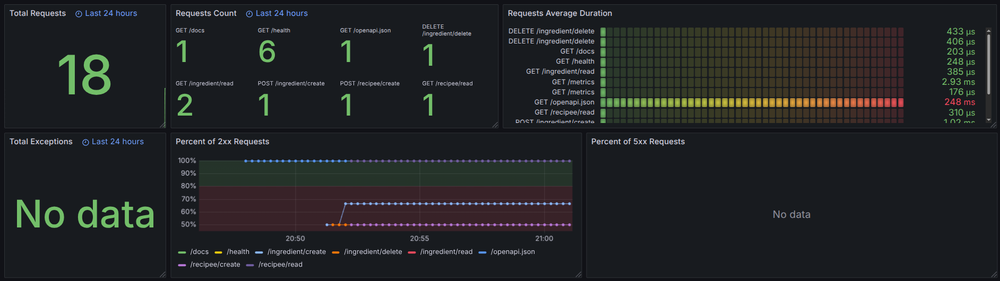
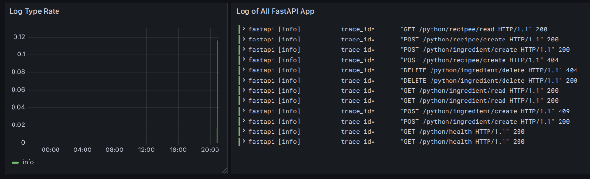

## Aula 7 - Monitoramento

Nessa aula implementamos o Grafana para visualização com Loki para logs e Prometheus para métricas.

O container do Prometheus faz uso do gateway para acessar o localhost da máquina e conseguir os dados dos outros containers, incluindo o da API.

A API não está dentro do compose meramente por tudo ter sido arquitetado na pasta de tarefas, diferente da pasta da própria API, para ter uma versão final mais organizada depois. A execução ocorre normalmente já que se usa o gateway local para acessar as portas de qualquer forma.

Seguem prints do dashboard para monitorar os logs e métricas da API no grafana, que adaptam do template disponível [nesse link](https://grafana.com/grafana/dashboards/16110-fastapi-observability/).

